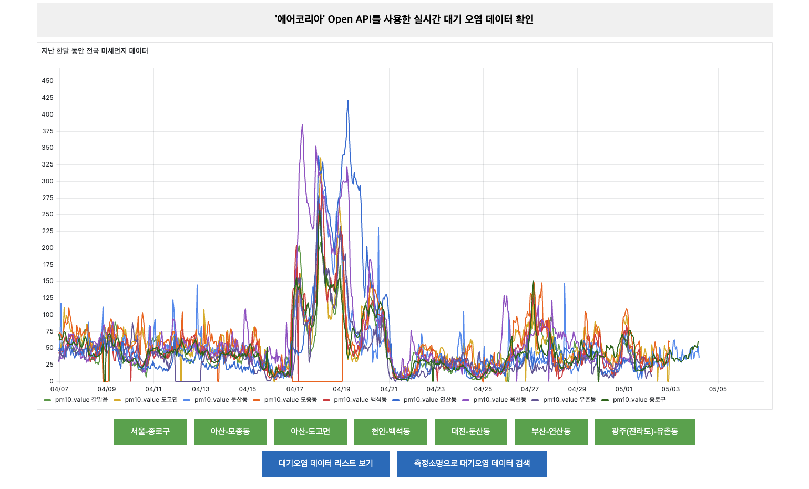
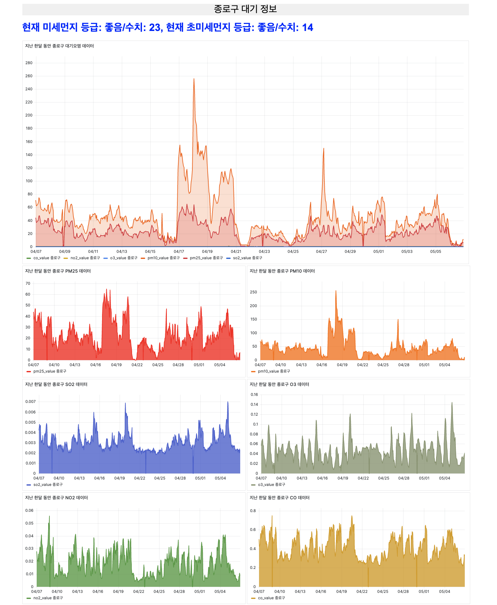
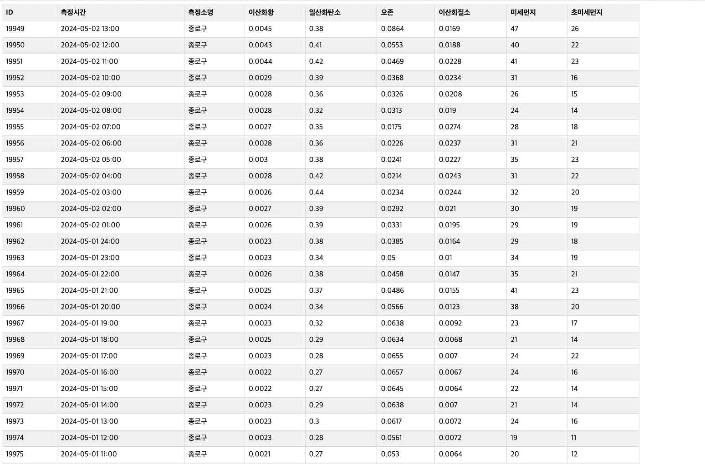

# 🌍 Korea Air Pollution - 대기오염 데이터 시각화 프로젝트

> **한국 환경부(에어코리아)의 OPEN API를 활용하여 대기오염 데이터를 시각화하는 웹 애플리케이션**  
> 특정 지역의 한 달간 미세먼지, 초미세먼지, SO2, CO, O3, NO2 농도를 조회하고 시각적으로 분석할 수 있습니다.

---

## 📸 프로젝트 미리보기
  
_🔥 대기오염 데이터를 한눈에 확인할 수 있는 대시보드_

---

## 📖 목차
- [📌 프로젝트 소개](#-프로젝트-소개)
- [🔍 주요 기능](#-주요-기능)
- [📦 기술 스택](#-기술-스택)
- [📊 데이터 수집 및 시각화](#-데이터-수집-및-시각화)
- [🌐 API 사용 방법](#-api-사용-방법)

---

## 📌 프로젝트 소개
이 프로젝트는 **한국 환경부(에어코리아)에서 제공하는 OPEN API**를 활용하여 **특정 지역의 대기오염 데이터를 시각화**하는 웹 애플리케이션입니다.

💡 **주요 목표**:
- 사용자가 관심 있는 지역을 선택하여 실시간 대기오염 정보를 조회 가능
- 한 달 동안의 미세먼지(PM10), 초미세먼지(PM2.5), SO2, CO, O3, NO2 농도를 그래프로 시각화
- 최신 데이터를 기반으로 현재 대기질 등급을 표시

---

## 🔍 주요 기능
✅ **지역별 대기오염 데이터 시각화** 
✅ **한 달 동안의 대기오염 변화 시각화** 
✅ **에어코리아 API를 활용한 실시간 데이터 수집**  
✅ **InfluxDB 및 Grafana 연동을 통한 대시보드 제공**  
✅ **특정 지역 데이터 검색가능**

## 예) 종로구 대기오염 데이터 시각화
  

## 예) 종로구 데이터 검색 기능
  

---

## 📦 기술 스택
### **🔗 Backend**
- **Spring Boot** - 서버 개발
- **InfluxDB** - 시계열 데이터 저장
- **MySQL** - 관계형 데이터 저장

### **💻 Frontend**
- **HTML / CSS / JavaScript**
- **Grafana** - 시각화 대시보드

### **☁️ API & 데이터**
- **에어코리아 OPEN API** - 실시간 대기오염 데이터 수집

---

## 📊 데이터 수집 및 시각화
1️⃣ API를 이용한 데이터 수집
AirPollutionService.java에서 에어코리아 API를 호출하여 대기오염 데이터를 가져옴.
InfluxDB & MySQL에 저장.

2️⃣ Grafana를 활용한 시각화
InfluxDB에서 실시간 데이터를 가져와 그래프 생성.
HTML <iframe> 태그를 활용해 웹 페이지에 삽입.

## 🌐 API 사용 방법
에어코리아 OPEN API를 활용하여 특정 지역의 데이터를 조회하는 방식.

## 🔹 데이터 요청 예제
GET https://api.airkorea.or.kr/v1/pollution?stationName=Seoul&dataType=json&apiKey=YOUR_API_KEY

## 🔹 응답 예시
{
  "dataTime": "2024-03-02 15:00",
  "stationName": "서울 종로구",
  "pm10Value": "35",
  "pm25Value": "20",
  "so2Value": "0.003",
  "coValue": "0.5",
  "o3Value": "0.02",
  "no2Value": "0.03"
}
